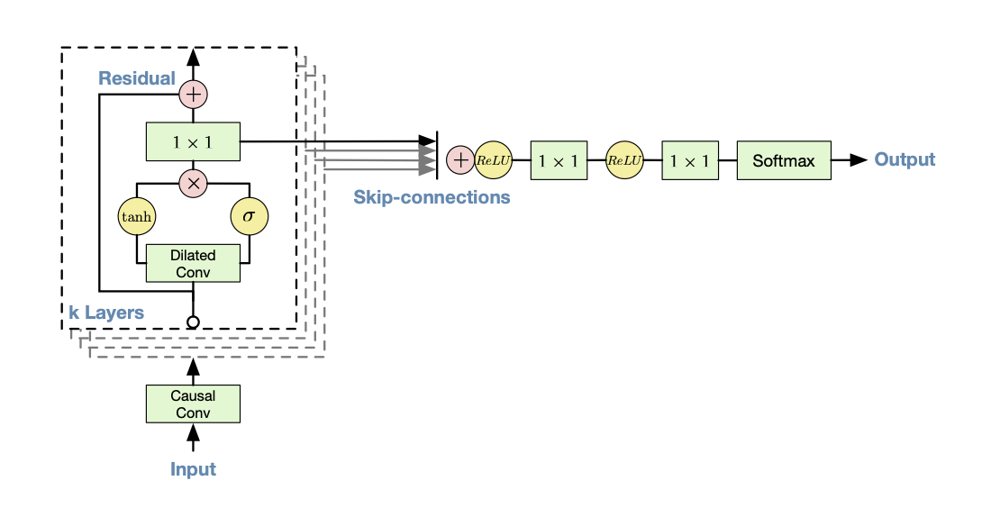

## Implementation of WaveNet

This is a implementation of WaveNet, a model for generating audio data.

## References
- [WaveNet Paper](https://arxiv.org/abs/1609.03499)
- [WaveNet Blog](https://deepmind.google/discover/blog/wavenet-a-generative-model-for-raw-audio/)

## Theoretical Background

### Audio Modeling
Like the n-gram model in NLP, WaveNet model considers that audio is related to previous audio signals, which can be expressed as :

$$
p(x) = \sum_{t=1}^{T} p(x_t | x_1, x_2, \dots, x_{t-1})
$$

## Model Architecture

### Dilated Causal Convolutions
To increase the receptive field and to reduce the computational cost, WaveNet uses **dilated causal convolutions** instead of the traditional causal convolutions.

### Softmax Distribution
Using the softmax to model the audio signal distribution is a common practice. However, since the audio signal usually be stored in 16-bit integer, softmax need to output 65536 values, which is too large for the model to handle. To solve this problem, WaveNet first apply the $\mu$-law companding transformation to the data, which can be expressed as :

$$
f(x_t) = \text{sign}(x_t) \cdot \frac{\log(1 + \mu |x_t|)}{\log(1 + \mu)}
$$

where $\mu$ is set to 255.

### Gated Activation Units
WaveNet uses the same gated activation units as used in the gated PixelCNN. The activation units are defined as :

$$
z = \tanh(W_{f, k} * x) \odot \sigma(W_{g, k} * x)
$$

where $*$ denotes the convolution operation, $\odot$ denotes the element-wise multiplication, $W_{f, k}$ and $W_{g, k}$ are the learnable convolution filter, and $\sigma$ is the sigmoid function.

**noted**: In my implementation, I use same kernel for gate and filter.

### Residual and Skip Connections

WaveNet uses the residual and skip connections to speed up convergence and enable traning more deeper model.

